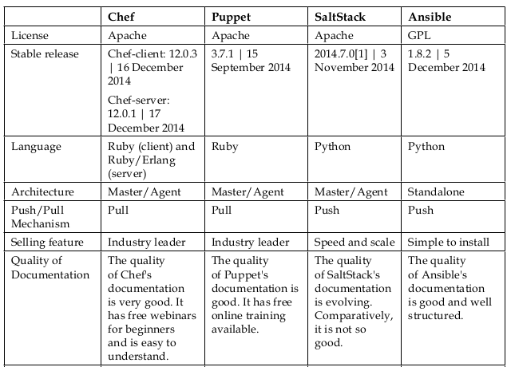

# Introduction

## 왜 Ansible 인가?

다음과 같은 니즈가 있을 경우 어떻게 처리할 것인가?

- 우리팀 전체 서버의 PING을 체크하고 싶다.
- 우리팀 전체 서버의 OS 버전을 알고 싶다.
- A라는 프로젝트에 10대의 신규 서버가 추가 투입되어 서버 셋팅이 필요하다.
- 어제날짜 기준 Nginx Access Log 건수를 알고 싶다.

이럴 때 Ansible 이 당신을 도와줄 것이다.


## 이번 강의는..

활용 보다는 첫 입문자가 어떻게 Ansible을 시작하고 Ansible 프로젝트를 어떻게 구성할지를 머리속에 그려주는 것을 중심으로 진행하겠다.


## Ansible 이란?

한문장으로 표현하자면..

### "쉽고 빠르게 배워서 편하고 쉽게 많은 서버를 관리"

- 굳이 정의를 내리자면 "***시스템 환경 설정 및 어플리케이션 배포 자동화 플랫폼*** "
- 학습하기 굉장히 쉽다
- 환경 구성이 너무 쉽다.
  - SSH 연결만 되면 된다
  - 에이전트 필요 없다
  - 관리 서버에만 Ansible 설치하면 끝!


## 환경

- 개발언어 : `python`

- 설정 문법  : `YAML`  (야믈)

- `Agent` 필요 없음

- `SSH` 

- 통신방법 : `json`

- 멱등성 보장

  - > **멱등법칙**(冪等法則) 또는 **멱등성**(冪等性, [영어](https://ko.wikipedia.org/wiki/%EC%98%81%EC%96%B4): idempotence)은 [수학](https://ko.wikipedia.org/wiki/%EC%88%98%ED%95%99)이나 [전산학](https://ko.wikipedia.org/wiki/%EC%A0%84%EC%82%B0%ED%95%99)에서 연산의 한 성질을 나타내는 것으로, 연산을 여러 번 적용하더라도 결과가 달라지지 않는 성질을 의미한다.  
    > (위키백과)[https://ko.wikipedia.org/wiki/%EB%A9%B1%EB%93%B1%EB%B2%95%EC%B9%99]

  - 쉽게 말하면 한번 설치한 건 다시 설치하지 않는다.

  - Ansible 모듈 대부분 멱등성을 제공하는데  
    멱등성을 제공하지 않는 일부 모듈이 있다.

    - `shell`, `command`, `file`

- Documentation
  - http://docs.ansible.com/
  - CLI에서는 `$ ansible-doc [Module]`


## 타 대표 제품과의 비교




## 설치

```sh
$ brew install ansible # for Mac
$ sudo yum install ansible # for CentOS
$ sudo apt-get ansible # Ubuntu
```


## 환경 파일

ansible 프로젝트 홈 밑에 아래 이름으로 생성하면 알아서 읽어드림  
옵션 참조 : http://docs.ansible.com/ansible/intro_configuration.html

```sh
$ANSIBLE_HOME/ansible.cfg
$ANSIBLE_HOME/.ansible.cfg
```


## 첫 걸음

### 홈 디렉토리 생성

> Ansible 홈 생성. 앞으로 이 디렉토리를 활용한다.

```Bash
$ mkdir learning_ansible
```

### 호스트 등록

```Sh
$ cd learning_ansible
$ mkdir -p hosts
# 프로젝트는 admin 이라 칭하자
$ vi ./hosts/admin
```

```
[web]
ansible-test-web01
ansible-test-web02

[db]
ansible-test-db01
```

### 명령어를 날려보자

```Sh
# ping
$ ansible all -i hosts/admin -m ping -u deploy -f 30
# setup
$ ansible all -i hosts/admin -m setup -u deploy -f 30
# setup with filter
$ ansible all -i hosts/admin -m setup -a "filter=ansible_distribution_*" -f 30
```

### 자주 사용하는 것들은 ansible.cfg 설정

-u deploy 은 매번 적기 귀찮으니 기본으로 설정되도록 ansible.cfg 에 설정한다.

```bash
$ vi ansible.cfg
```

```Sh
[defaults]
forks = 50 
host_key_checking = False
remote_user = deploy
remote_port = 22
```

- forks :  병렬 처리 시 프로세스 개수 (default가 5였으나 최근엔 30으로 변경됨)
- host_key_checking: ssh 첫 접속 시 yes/no 출력 무시


### 다시 명령어를 날려보자

``` sh
# ping
$ ansible all -i hosts/first -m ping

# setup
$ ansible all -i hosts/first -m setup

# web 서버만 ping
$ ansible all -i hosts/first -l web -m ping

# ansible-test-web01 서버만 ping 체크
$ ansible all -i hosts/first -l "ansible-test-web01" -m ping

# ansible-test-web01,02 2대 서버만 ping 체크
$ ansible all -i hosts/first -l "ansible-test-web01,ansible-test-web02" -m ping
$ ansible all -i hosts/first -l "ansible-test-web01 ansible-test-web02" -m ping
$ ansible all -i hosts/first -l "ansible-test-web0[1-2]" -m ping
```


## 인벤토리

### 호스트와 그룹

일반적인 형태

```
mail.example.com

[webservers]
foo.example.com
bar.example.com

[dbservers]
one.example.com
two.example.com
three.example.com
```

별칭 지정 및 터널을 통해 연결 하고자 할 경우

```javascript
jumper ansible_port = 5555 ansible_host = 192.0.2.50
```

그밖의 여러가지 형태

```java
[webservers]
www[01:50].example.com

[databases]
db-[a:f].example.com
  
[targets]
localhost              ansible_connection=local
other1.example.com     ansible_connection=ssh        ansible_user=mpdehaan
other2.example.com     ansible_connection=ssh        ansible_user=mdehaan
```

> 파라미터 종류들
> http://docs.ansible.com/ansible/latest/intro_inventory.html#list-of-behavioral-inventory-parameters

### 호스트에 대한 변수 지정

```java
[atlanta]
host1 http_port=80 maxRequestsPerChild=808
host2 http_port=303 maxRequestsPerChild=909
```

### 그룹의 그룹, 그룹에 대한 변수 지정

이해하기 쉽게 우리나라 지역 한글명으로 설명한다.

```
[전라남도]
목포
순천

[전라북도]
전주
정읍

[전라도:children]
전라남도
전라북도

[전라도:vars]
some_server=foo.southeast.example.com
halon_system_timeout=30
self_destruct_countdown=60
escape_pods=2

...(중략)...

[대한민국:children]
전라도
경상도
경기도
```

그렇다면 이런식으로 실행을 할 것이다.

```Sh
$ ansible all -i hosts/korea -l "대한민국"
$ ansible all -i hosts/korea -l "전라도"
$ ansible all -i hosts/korea -l "전라도,경기도"
$ ansible all -i hosts/korea -l "목포 순천"
```


## Ansible 실행 및 옵션

기본적인 형태

```sh
ansible all -i hosts/web -l "alpha,sandbox" -m copy -a "src=/etc/hosts dest=/tmp/hosts" -f 50
```

- `-i` : INVENTORY
- `-l` : LIMIT. SUBSET. 그룹 혹은 호스트 지정
- `-m` : MODULE_NAME. Ansible에서 정의한 모듈을 사용([모듈보기](http://docs.ansible.com/ansible/modules_by_category.html)).지정한 모듈을 사용해야  ***멱등성*** 을 보장 받을 수 있음.
- `-a` : MODULE_ARGS
- `-f` : FORKS. 병렬 처리 시 프로세스 개수 (default : 30) 
- `-e` : EXTRA_VARS. 추가적으로 변수 사용 시


## 실행 예

모듈 종류 : http://docs.ansible.com/ansible/latest/list_of_all_modules.html

``` sh
# Copy
$ ansible atlanta -m copy -a "src=/etc/hosts dest=/tmp/hosts"

# File
$ ansible webservers -m file -a "dest=/srv/foo/a.txt mode=600"
$ ansible webservers -m file -a "dest=/srv/foo/b.txt mode=600 owner=mdehaan group=mdehaan"
$ ansible webservers -m file -a "dest=/path/to/c mode=755 owner=mdehaan group=mdehaan state=directory"
$ ansible webservers -m file -a "dest=/path/to/c state=absent"

# Yum
$ ansible webservers -m yum -a "name=acme state=present"
$ ansible webservers -m yum -a "name=acme-1.5 state=present"
$ ansible webservers -m yum -a "name=acme state=latest"
$ ansible webservers -m yum -a "name=acme state=absent"

# Users and groups
$ ansible all -m user -a "name=foo password=<crypted password here>"
$ ansible all -m user -a "name=foo state=absent"

# Deploying From Source Control
$ ansible webservers -m git -a "repo=git://foo.example.org/repo.git dest=/srv/myapp version=HEAD"

# Managing services
$ ansible webservers -m service -a "name=httpd state=started"
```

